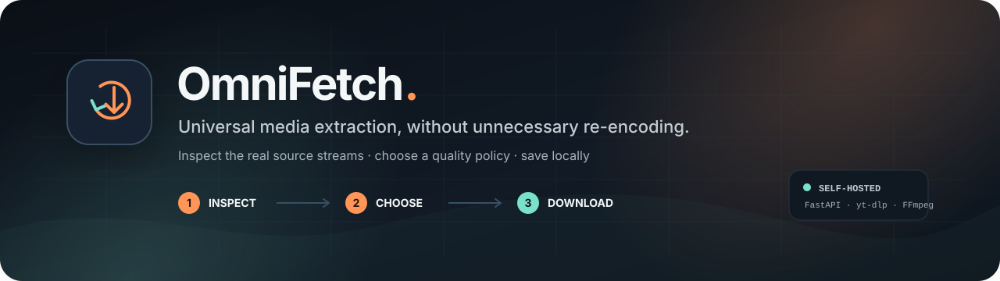
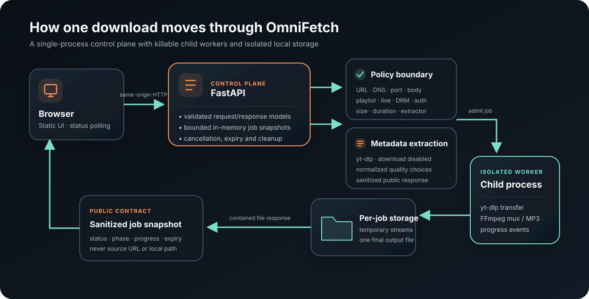
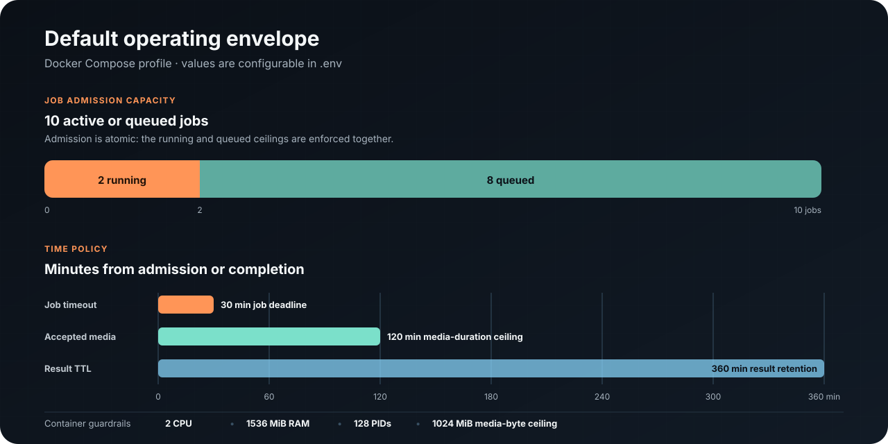

<p align="center">
  
</p>

<p align="center">
  <a href="pyproject.toml"></a>
  <a href="pyproject.toml"></a>
  <a href="backend/tests"></a>
  <a href="docker-compose.yml"></a>
  <a href="SECURITY.md"></a>
</p>

<p align="center">
  Paste a public or authorized media URL, inspect the streams exposed by its source,
  choose a quality policy, and save the result without unnecessary re-encoding.
</p>

<p align="center">
  <a href="#quick-start">Quick start</a> ·
  <a href="#how-it-works">Architecture</a> ·
  <a href="#api-at-a-glance">API</a> ·
  <a href="#deployment-guide">Deployment</a> ·
  <a href="docs/deployment.md">Configuration</a> ·
  <a href="docs/testing.md">Testing</a>
</p>

> [!IMPORTANT]
> OmniFetch 0.4.0 is a local, single-user application. The supported runtime is
> preferably the hardened Docker Compose profile. Vercel uses a bounded
> single-request streaming mode for short transfers; it is not a durable job
> runtime. OmniFetch is not an access-control bypass, DRM circumvention tool,
> credential-sharing service, or production-ready public downloader.

## Why OmniFetch

OmniFetch keeps the interface small while putting strict boundaries around a
powerful extraction engine. It delegates changing site compatibility to
[yt-dlp](https://github.com/yt-dlp/yt-dlp), uses FFmpeg only when streams need
muxing or the user explicitly requests MP3, and exposes a narrow policy API
instead of arbitrary downloader options.

| Capability | What it means |
|---|---|
| **Source-aware quality** | Lists the real video and audio choices reported by the source; no artificial upscaling. |
| **URL-aware platform control** | Detects LinkedIn, Reddit, Snapchat, Bluesky, Tumblr, and other known services while you paste, then labels the inspection action before any request is sent. |
| **Codec-light source support** | Accepts direct MP4 streams from social extractors even when the source omits codec details. |
| **Loss-conscious output** | Preserves source streams where possible. MP3 conversion is explicit because it is lossy. |
| **Bounded jobs** | Enforces queue, concurrency, byte, duration, wall-time, expiry, and cleanup limits. |
| **Isolated execution** | Runs each download in a killable child process with a contained per-job workspace. |
| **Safer API contract** | Clients select a mode and optional height—not raw yt-dlp selectors, headers, cookies, or proxies. |
| **Optional authorized access** | Can use one operator-mounted Netscape cookie file through private short-lived copies. |
| **Single-origin UI and API** | FastAPI serves the static frontend and versioned JSON API from one process. |
| **Operational visibility** | Provides liveness, readiness, progress polling, cancellation, safe errors, and expiry metadata. |

OmniFetch 0.5 uses a tested, reproducibly pinned yt-dlp nightly because yt-dlp
recommends its nightly channel for regular users who need current site fixes.
Site compatibility can change as platforms and yt-dlp evolve. A URL that works
today may require a dependency update later even when OmniFetch itself has not
changed.

## How it works

<p align="center">
  
</p>

The browser first requests metadata without downloading media. OmniFetch checks
the URL and source policy, normalizes the available formats, then atomically
admits a bounded job. Inside that job, the validated extraction result is reused
for transfer so a social post is not fetched twice in quick succession. A fresh
extraction is attempted only after a recognized expired or denied media URL. A
supervised child process runs yt-dlp and FFmpeg, reports sanitized progress
events, and writes one final file to an isolated directory.

The Phase-1 job store is intentionally in memory. Restarting the API terminates
managed workers and loses active job records; an independent storage sweep
removes orphaned directories. See [Architecture](docs/architecture.md) for the
trust boundaries and Phase-2 evolution path.

## Quick start

### Docker Compose — recommended

Requirements: Docker Engine with Compose v2.

```bash
git clone https://github.com/VidulaWickramasinghe/Omni_Fetch.git
cd Omni_Fetch
cp .env.example .env
docker compose up --build
```

Open <http://127.0.0.1:8000>. The image includes Python, FFmpeg, Deno, yt-dlp's
external challenge scripts, and browser-impersonation support.

```bash
docker compose ps
docker compose logs --follow api
docker compose down
```

The `omnifetch-data` volume survives an ordinary restart. Running
`docker compose down -v` also removes retained downloads, so use it only when
that data should be erased.

### Run from source

Requirements:

- Python 3.12–3.14;
- Node.js 22+, Deno 2.3+, or another supported yt-dlp JavaScript runtime;
- a platform supported by the dependency installation in `make install-dev`.

```bash
git clone https://github.com/VidulaWickramasinghe/Omni_Fetch.git
cd Omni_Fetch
make install-dev
make run
```

Then open <http://127.0.0.1:8000>. A system FFmpeg installation is preferred;
the source setup can fall back to the bundled `imageio-ffmpeg` binary where
supported.

## Use the application

1. Paste a public URL, or enable the configured login session for media the
   operator account is already authorized to access.
2. Inspect the source to load its normalized metadata and quality choices.
3. Choose an output mode and, for video, an optional maximum height.
4. Start the job and follow `Inspect → Download → Process → Ready`.
5. Save the completed file before its configured retention window expires.

### Output modes

| Mode | Selection policy | Re-encoding |
|---|---|---|
| `original` | Best available video plus audio, preferring a lossless mux. | No, unless the source forces processing outside policy. |
| `mp4` | Prefer MP4-compatible video/audio combinations offered by the source. | No artificial quality conversion. |
| `audio` | Keep the best native source audio stream. | No. |
| `audio_mp3` | Convert the best audio stream to MP3. | **Yes—explicitly lossy.** |

"Best" means the highest stream available to the extractor. It does not mean
enhanced, reconstructed, or upscaled media.

## API at a glance

Media and job endpoints are under `/api/v1`; health endpoints remain at the
root. Interactive OpenAPI documentation is available at `/docs` while the app
is running.

| Method and path | Purpose |
|---|---|
| `POST /api/v1/extract` | Validate a URL and return normalized metadata plus safe quality choices. |
| `POST /api/v1/download` | Admit a bounded background job using `mode` and optional `max_height`. |
| `GET /api/v1/auth/status` | Report whether the operator-mounted login session is usable, without secret details. |
| `GET /api/v1/jobs/{job_id}` | Return a sanitized job snapshot and progress. |
| `GET /api/v1/jobs/{job_id}/file` | Stream a completed result with safe download headers. |
| `DELETE /api/v1/jobs/{job_id}` | Cancel an active job or remove a terminal job and its file. |
| `GET /api/v1/platforms` | Return display labels, not a guaranteed compatibility list. |
| `GET /health` | Liveness check used by Docker Compose. |
| `GET /ready` | Verify manager, storage, authentication, FFmpeg, JavaScript, and extractor support. |

Example:

```bash
curl --request POST http://127.0.0.1:8000/api/v1/extract \
  --header 'Content-Type: application/json' \
  --data '{"url":"https://example.com/authorized-video","use_auth":false}'

curl --request POST http://127.0.0.1:8000/api/v1/download \
  --header 'Content-Type: application/json' \
  --data '{"url":"https://example.com/authorized-video","mode":"original","max_height":1080,"use_auth":false}'
```

Clients cannot submit raw yt-dlp selectors or options. See the
[API reference](docs/api.md) for schemas, status transitions, error semantics,
and a complete polling example.

## Default operating envelope

<p align="center">
  
</p>

The chart uses the checked-in Compose defaults: two running jobs, eight queued
jobs, a 30-minute job deadline, a 120-minute known-media duration ceiling, and
a six-hour terminal-result TTL. The container is additionally capped at 2 CPU,
1536 MiB of memory, 128 PIDs, and 1024 MiB of aggregate media bytes per job.
Intermediate streams can require more storage than the final output.

These are guardrails, not performance targets. Change them in `.env` only after
checking disk, memory, CPU, network, and source behavior together.

## Deployment guide

| Runtime | Status | Notes |
|---|---|---|
| **Docker Compose on one trusted machine** | Supported | Recommended Phase-1 profile; loopback-only port, read-only root, non-root user, bounded resources, persistent data volume. |
| **Direct source run** | Supported | Best for development; the host must provide the media runtime dependencies. |
| **Persistent container or VM** | Adaptable | Add TLS, OmniFetch user authentication, quotas, rate limits, durable queueing, object storage, and enforced worker egress before public use. |
| **Vercel Python Function** | Limited | Uses one streaming response that keeps extraction, transfer, progress, and file delivery inside the same invocation. Intended for short, bounded media—not durable or multi-user jobs. |

### How Vercel delivery differs

`pyproject.toml` declares the FastAPI entrypoint and OmniFetch automatically
uses `/tmp/omnifetch/downloads` on Vercel, avoiding writes to the read-only
deployment bundle. On Vercel, `POST /api/v1/download` does not return a detached
job identifier. It opens a streaming response immediately, sends sanitized job
events while the isolated worker runs, and then sends the completed file over
that same response. This prevents the function from pausing at `Inspect` after
an early `202` response and bypasses the normal buffered-response size ceiling.

The Vercel profile defaults to one active transfer, no queue, a 240-second job
deadline, and a 256 MiB media-byte ceiling. The whole invocation—including file
delivery—must still finish within the hosting plan's function-duration limit.
For durable, long-running, or multi-user downloads, deploy the Docker image to
persistent compute or add a durable queue, workers, object storage, and signed
result URLs.

### Deployment troubleshooting

| Symptom | Check |
|---|---|
| `500 FUNCTION_INVOCATION_FAILED` with a read-only path | Redeploy the current code; Vercel must use `/tmp/omnifetch/downloads`, never `backend/downloads`. |
| Download remains at `Inspect` on Vercel | Redeploy the current frontend and backend together; the response must use `application/vnd.omnifetch.download`. |
| Download stops before producing a file | Inspect worker stderr and confirm the selected media fits the runtime's size and duration limits. |
| `/ready` returns `503` | Verify writable storage, FFmpeg, Deno/Node, yt-dlp external scripts, impersonation support, and the optional cookie source. |
| A platform suddenly fails | Update yt-dlp within the supported range and review safe server logs; extractors and platform anti-bot behavior change independently. |
| Queue returns `429` | Wait for an active job to finish or deliberately adjust concurrency and resource ceilings. |

Read [Local deployment and configuration](docs/deployment.md) before adapting
the runtime or exposing any part of the service beyond loopback.

## Optional authenticated media

Authenticated mode is for one trusted, self-hosted operator. Export a narrowly
scoped Mozilla/Netscape cookie file, keep it outside Git, and configure:

```dotenv
OMNIFETCH_COOKIE_FILE_HOST=/absolute/path/to/cookies.txt
OMNIFETCH_ENABLE_AUTHENTICATED_MEDIA=true
```

Then restart with `docker compose up --build`. The source file is mounted
read-only. OmniFetch validates it, creates a private `0600` working copy for
each extraction or job because yt-dlp may update its jar, and removes that copy
on success or failure.

Cookie contents never belong in API requests, logs, job records, child events,
or Git. Use a dedicated least-privileged platform account and revoke its source
session after suspected leakage. Authenticated mode does not enable DRM,
playlist/feed downloading, paywall bypass, proxy rotation, or anti-bot evasion.
See the [secrets guide](secrets/README.md).

## Configuration

Copy [`.env.example`](.env.example) and adjust only the limits required for the
host. Values below are Docker Compose defaults.

| Variable | Default | Purpose |
|---|---:|---|
| `OMNIFETCH_MAX_FILESIZE_MB` | `1024` | Aggregate media-byte ceiling per job. |
| `OMNIFETCH_MAX_DURATION_MIN` | `120` | Maximum accepted known media duration. |
| `OMNIFETCH_MAX_CONCURRENT_JOBS` | `2` | Child workers allowed to run together. |
| `OMNIFETCH_MAX_QUEUED_JOBS` | `8` | Additional admitted jobs waiting for a worker. |
| `OMNIFETCH_JOB_TIMEOUT_SECONDS` | `1800` | Wall-time deadline for one job. |
| `OMNIFETCH_JOB_TTL_HOURS` | `6` | Retention for terminal records and completed files. |
| `OMNIFETCH_MAX_BODY_BYTES` | `8192` | Maximum accepted JSON request body. |
| `OMNIFETCH_PUBLIC_MODE` | `false` | Apply the stricter known-platform policy; **not** a production-readiness switch. |
| `OMNIFETCH_ALLOW_GENERIC_EXTRACTOR` | `false` | Permit yt-dlp's broad Generic extractor in public mode. |
| `OMNIFETCH_ENABLE_AUTHENTICATED_MEDIA` | `false` | Allow explicit use of the mounted operator session. |
| `OMNIFETCH_ALLOWED_PORTS` | `80,443` | Destination ports accepted by URL policy. |
| `OMNIFETCH_ALLOWED_ORIGINS` | loopback origins | Browser origins accepted during source development. |

Invalid, malformed, zero, negative, or unsafe values fail at startup. The
[deployment reference](docs/deployment.md#environment-variables) documents the
complete environment surface.

## Security and responsible use

OmniFetch validates schemes, ports, hostnames, DNS answers, body size, source
policy, duration, bytes, concurrency, and elapsed time. Responses omit source
URLs, signed query strings, local paths, raw extractor data, worker PIDs, and
internal exceptions.

Application checks are defense in depth—not network isolation. Redirects,
DNS rebinding, extractor-discovered manifests, media CDNs, and FFmpeg can create
additional outbound paths. A public service requires enforced worker egress
policy, authentication, ownership, quotas, rate limits, TLS, durable state,
object storage, monitoring, and a legal/abuse process.

Use OmniFetch only for public or authenticated media you have the right or
permission to save. Users remain responsible for copyright, licenses, privacy,
source terms, and applicable law. See [SECURITY.md](SECURITY.md) for the threat
model and vulnerability-reporting guidance.

## Development and testing

```bash
make install-dev
make test
make test-cov
make lint
make format-check
make audit
```

The deterministic suite currently collects **160 cases** across API contracts,
URL policy, extraction, download bounds, job state, authentication, runtime
discovery, process supervision, filesystem containment, and cleanup. Third-party
network calls are mocked; real-site compatibility checks are intentionally not
part of CI.

## Repository map

```text
Omni_Fetch/
├── backend/
│   ├── app/
│   │   ├── api/          # versioned FastAPI routes
│   │   ├── services/     # policy, extraction, jobs, manager, runtime
│   │   └── workers/      # isolated download worker entrypoint
│   ├── tests/            # deterministic unit, API, and integration tests
│   └── Dockerfile        # non-root API/frontend image
├── frontend/             # dependency-free same-origin web application
├── docs/                 # architecture, API, deployment, testing, visuals
├── secrets/              # cookie-file setup guidance; no real credentials
├── docker-compose.yml    # hardened loopback-only Phase-1 profile
├── pyproject.toml        # package metadata, dependencies, tool settings
└── Makefile              # install, run, test, lint, audit, Compose commands
```

## Documentation

- [Architecture and trust boundaries](docs/architecture.md)
- [API schemas and job lifecycle](docs/api.md)
- [Deployment and every environment variable](docs/deployment.md)
- [Testing strategy](docs/testing.md)
- [Security policy](SECURITY.md)
- [Contribution guide](CONTRIBUTING.md)

## Phase 2

When persistent or multi-user operation is required, keep the API contract and
replace the Phase-1 internals in this order:

1. Move admission and jobs to a durable Redis-backed queue.
2. Run media workers separately with independent resource and egress controls.
3. Store results in S3/MinIO and issue short-lived signed downloads.
4. Add users, job ownership, quotas, rate limits, audit logs, and a credential
   vault that passes opaque references—not raw session material.
5. Add PostgreSQL only when durable accounts, billing, or history require it.

Redis, PostgreSQL, object storage, Kubernetes, and a monitoring stack are not
required for the current trusted, single-host profile.

---

Contributions are welcome. Start with [CONTRIBUTING.md](CONTRIBUTING.md), keep
real credentials and downloaded media out of Git, and use controlled or
public-domain fixtures for tests.
